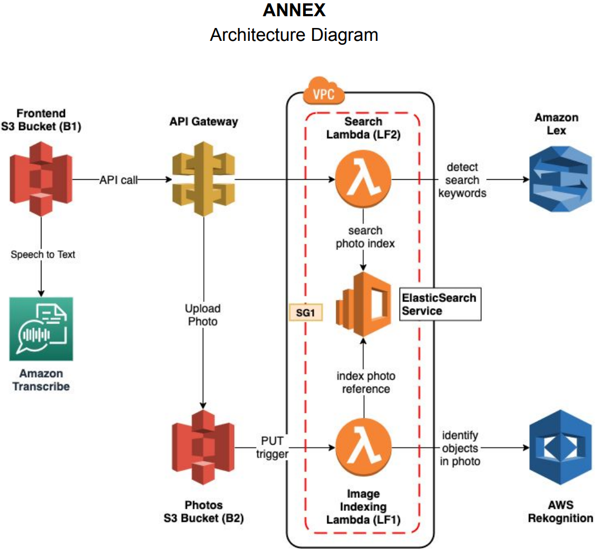

# Voice-Controlled-Photo-Searcher

- Voice Controlled Photo Searcher is an AWS-based serverless cloud application that
    - Stores photos in AWS cloud space
    - Photos can be searched using natural language through both text and voice

- Example:
    - User Inputs (voice or text, through frontend web page): 
        - "Dogs"
        - "Show me dogs"
        - "Show me cats and dogs"
    - Returns (displayed in frontend web page):
        - Photos with dogs
        - Photos with dogs
        - Photos with cats and dogs

- AWS services used:
    - **Elastic Search** to fastly search photo in a large scale
    - **VPC** to prevent unauthorized access
    - **S3** to store photos and frontend webpages
    - **Lex** to detect searching keywords
    - **Rekognition** to automatically identify and tag photos
    - **Lambda** to trigger and process events (storing, tagging, indexing, searching photos)
    - **API Gateway**
    - **Amazon Transcribe** to transcribe speech to text in real time
    - **CodePipeline** to automatically deploy new commits from GitHub
    - **CloudFormation** to formate template that represents all the infrastructure

- See full [Instructions](Instruction.pdf)

- Architecture Diagram

